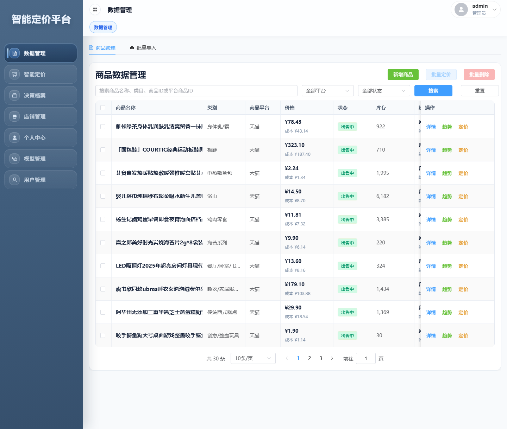
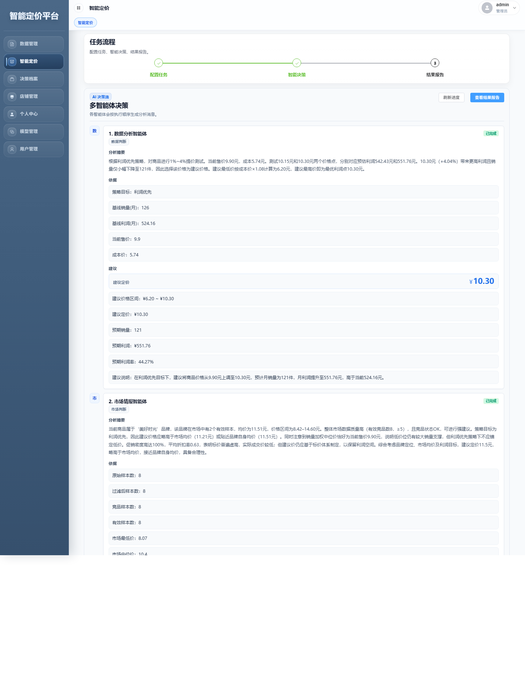
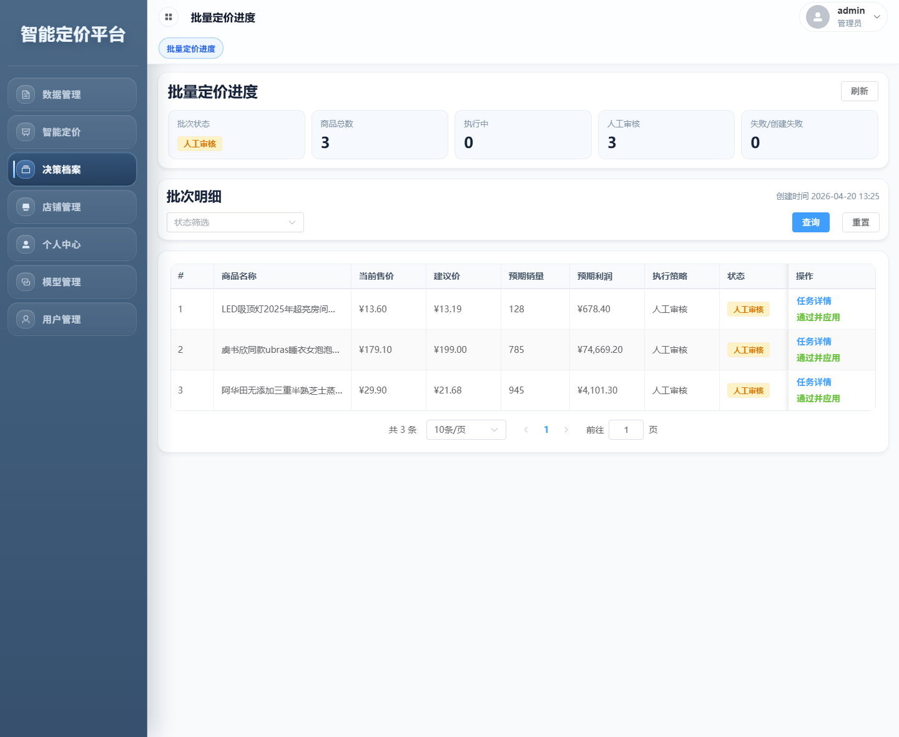

# 电商智能定价平台

电商智能定价平台是一个面向电商运营场景的多服务协同系统，用于支持商品管理、定价分析、批量任务处理、结果回看与智能辅助决策。项目以完整业务系统为基础，将智能定价能力嵌入到商品运营流程中，兼顾系统可用性与分析能力展示。

系统采用前后端分离与双后端协作架构：前端负责业务交互与结果展示，Java 后端作为统一对外入口，负责鉴权、业务接口、任务编排与 SSE 推送；Python Worker 负责执行多智能体定价流程，并通过 RabbitMQ 与 MySQL 完成异步处理、任务落库与结果回写。

## 项目亮点

- **业务系统与智能定价结合**：既覆盖用户、店铺、商品、任务、结果等业务链路，也突出多智能体辅助定价这一核心特色。
- **双后端协同架构**：Java 作为统一对外业务入口，Python 作为内部智能任务执行端，职责边界清晰。
- **异步任务派发机制**：通过 RabbitMQ 解耦任务创建与智能体执行流程，适配单商品与批量定价场景。
- **实时任务流展示**：前端通过 Java SSE 接收任务状态变化与 Agent 卡片更新，支持过程可视化。
- **批量定价与人工复核**：支持批量任务执行、建议价汇总和人工审核后的结果应用。
- **本地竞品情报能力**：市场情报基于本地天猫 CSV 竞品索引组织，而不是无约束的模拟数据输出。

## 系统架构

```text
Browser
  -> Frontend (Vue 3)
    -> Java Backend (:8080, public API + SSE)
      |-- MySQL (business data / result query)
      `-- RabbitMQ (async task dispatch)
           -> Python Worker (:8000, internal only)
             -> MySQL (task logs / pricing results)
```

### 服务职责

- **Frontend**：负责页面展示、用户交互、任务发起和结果查看。
- **Java Backend**：负责统一对外 API、鉴权、业务编排、任务派发、结果查询与 SSE 实时推送。
- **Python Worker**：负责消费 RabbitMQ 任务、执行多智能体定价流程，并写入任务日志与定价结果。
- **RabbitMQ**：负责定价任务的异步派发与解耦。
- **MySQL**：负责业务数据、任务状态、执行日志与结果持久化。

### 架构边界

- 浏览器只访问 Java 暴露的 `/api/**` 接口，Java 是唯一对外业务入口。
- Python 是内部服务，不直接面向浏览器开放，并通过内部令牌保护内部调用。
- 主任务派发走 RabbitMQ；Java 与 Python 的内部 HTTP 交互主要用于健康检查、任务状态/详情/日志查询和重试协调。
- Java 负责实时 SSE 事件流，前端不直接连接 Python。
- Python 负责执行智能定价流程并写回结果，Java 负责对外查询、任务协调与展示。

## 核心功能

### 1. 用户与店铺管理
- 支持用户登录、刷新、登出与基础会话管理。
- 支持店铺维度的数据接入与后续商品运营使用。

### 2. 商品与数据管理
- 支持商品、SKU、经营数据与导入数据管理。
- 支持商品检索、筛选和批量定价入口触发。

### 3. 单商品智能定价
- 支持按商品发起智能定价任务。
- 展示多智能体分析摘要、关键依据、建议结果与任务进度。

### 4. 批量定价任务
- 支持批量创建定价任务、统一查看批次执行状态。
- 支持查看子任务建议价、执行结果与人工审核数量。

### 5. 智能分析与风控
- 通过多智能体完成数据分析、市场情报、风险控制与综合协调。
- 支持基于本地天猫 CSV 竞品索引生成市场情报摘要。

### 6. 结果查看与历史归档
- 支持查看定价结果、任务日志、历史记录与归档内容。
- 支持在系统内应用审核后的建议价并保留应用痕迹。

## 界面展示

### 1. 商品管理与批量定价入口



在商品管理页面中，用户可以完成商品检索、平台与状态筛选，并从业务列表直接发起批量定价任务，查看商品价格、库存与基础经营表现。

### 2. 单商品智能定价决策流



智能定价页面展示单商品任务从启动到完成的主要过程，包括多智能体分析摘要、关键依据、建议结果与阶段性反馈。

### 3. 批量定价进度与结果汇总



批量定价页面集中展示批次状态、人工审核数量、子任务建议价与执行策略，便于统一回看批量任务执行结果。

## 技术栈

- **前端**：Vue 3、TypeScript、Vite、Element Plus、Pinia、ECharts
- **业务后端**：Spring Boot 3.2、Java 21、MyBatis-Plus、JWT、SSE
- **智能任务后端**：FastAPI、Python 3.12、CrewAI、SQLAlchemy、Pydantic
- **数据与中间件**：MySQL 8.4、RabbitMQ 3.13、SQLite（竞品索引）
- **部署与运维**：Docker Compose、Nginx、PowerShell 脚本

## 项目结构

- `frontend/`：Vue 3 前端工程，负责页面展示、交互、任务发起和结果查看。
- `backend-java/`：Spring Boot 业务后端，负责鉴权、业务编排、任务派发、SSE 推送与结果查询。
- `backend-python/`：FastAPI 内部 Worker，负责多智能体定价流程执行、任务日志写入与结果生成。
- `database/`：数据库基线建表 SQL 与增量迁移脚本。
- `docs/`：接口文档、截图资源与补充说明文档。
- `scripts/`：本地开发、部署、回滚、检查、备份等脚本。
- `ops/`：运行手册、压测、告警与运维说明。

## 快速开始 / 本地运行

### 环境依赖

- Node.js 20+
- Java 21
- Maven 3.9+
- Python 3.12
- MySQL 8+
- RabbitMQ 3.13+

### 推荐启动顺序

1. MySQL
2. RabbitMQ
3. Python Worker
4. Java Backend
5. Frontend

### 手动启动

```powershell
# Java
cd backend-java
mvn spring-boot:run

# Python
cd backend-python
python -m venv .venv
.venv\Scripts\activate
pip install -r requirements.txt
python -m uvicorn app.main:app --reload --port 8000

# Frontend
cd frontend
npm install
npm run dev
```

### 一键启动

```powershell
scripts/start-local-dev.ps1
```

说明：

- 该脚本会拉起前端、Java、Python 三个应用进程。
- MySQL、RabbitMQ 等基础设施需预先可用。
- 首次执行前，需要先在 `backend-python/` 下创建 `.venv` 并安装 `requirements.txt` 依赖。
- 如需提高批量定价任务的并发消费能力，可通过环境变量 `RABBITMQ_WORKER_CONCURRENCY` 调整 Python Worker 的 RabbitMQ consumer 数量；默认值为 `1`。
- Windows 本地如遇 uvicorn `accept` / `WinError 10014` 一类问题，可改用 `python run_server.py`，它会补充本仓库使用的 Selector loop 与 `h11` 参数。

## 测试与验证

```powershell
# Java
cd backend-java
mvn test

# Python
cd backend-python
python -m pytest tests -q

# Frontend
cd frontend
npm run build

# 全量预发布检查
scripts/run-prelaunch-checks.ps1
```

## 部署说明

Public Beta 推荐使用仓库脚本部署，该脚本会显式加载 `.env.public-beta`、执行镜像构建、等待关键服务就绪并自动应用数据库迁移。

```powershell
powershell -ExecutionPolicy Bypass -File .\scripts\deploy-public-beta.ps1
```

如需手动执行 Docker Compose，请显式指定环境变量文件：

```powershell
docker compose --env-file .env.public-beta -f docker-compose.public-beta.yml up -d --build
```

### 当前容器运行方式

- Python Worker 挂载 `backend-python/` 并通过 `uvicorn --reload` 运行。
- Frontend 挂载 `frontend/` 并通过 Vite dev server 运行，仍对外暴露 `FRONTEND_PUBLIC_PORT`。
- Java Backend 构建最终 jar 镜像并直接运行，Maven 依赖只在镜像构建阶段解析。

### 热更新与重建说明

前端热重载未生效时，可执行：

```powershell
docker compose --env-file .env.public-beta -f docker-compose.public-beta.yml up -d --build --force-recreate
```

之后只修改前端或 Python 源码时，可以直接在 Docker Desktop 启动这组容器，前端源码会通过 Vite 热重载刷新。修改 Java 源码、`frontend/package.json`、`package-lock.json`、Dockerfile 或 Compose 配置时，再重新执行 `up -d --build --force-recreate`。

### 常见检查项

1. frontend 容器是否已经是 `node:20-alpine` + `5173` 的 Vite dev server。
2. 浏览器是否访问 `FRONTEND_PUBLIC_PORT`，默认 `http://127.0.0.1:8081/`。
3. Vite 日志是否启动成功：

```powershell
docker compose --env-file .env.public-beta -f docker-compose.public-beta.yml logs -f frontend
```

### 相关说明

- 首次部署前先基于 `.env.public-beta.example` 复制并填写 `.env.public-beta`。
- 不要直接执行 `docker compose -f docker-compose.public-beta.yml up -d --build`，该写法不会读取 `.env.public-beta`。
- `docker-compose.public-beta.yml` 中 MySQL 对外端口使用 `${MYSQL_PUBLIC_PORT:-3306}:3306`，而示例环境文件默认将 `MYSQL_PUBLIC_PORT` 设为 `3307`，用于避免与宿主机已运行的本地 MySQL `3306` 端口冲突。
- 生产部署时需要显式配置数据库密钥、JWT 密钥、内部令牌和跨域白名单。

### 相关文件

- `docker-compose.public-beta.yml`
- `.env.public-beta.example`
- `frontend/nginx.default.conf`
- `scripts/deploy-public-beta.ps1`
- `scripts/rollback-public-beta.ps1`

## 文档入口

- [API文档](./docs/API文档.md)：按模块整理的接口说明文档。
- [技术栈](./技术栈.md)：完整技术栈与依赖说明。
- [AGENTS](./AGENTS.md)：仓库协作约束与关键架构规则。

## 能力边界 / 注意事项

- “应用价格建议”会把审核后的建议价写回本系统的 `product.current_price`，并记录应用人、应用时间和应用前价格；当前不直接调用淘宝、京东、拼多多等外部电商平台改价接口。
- 市场情报来自本地天猫 CSV 竞品索引生成的 SQLite 数据，Python Worker 按类目和标题匹配竞品样本；当前不是实时爬取，也不是实时调用第三方平台数据接口。
