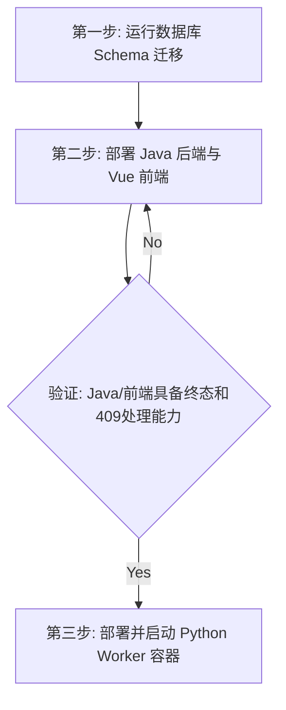

# backend-python Agent 架构优化方案（多角色评审修订版）

生成时间：2026-06-03  
修订时间：2026-06-03  
项目路径：`D:\代码\graduation_project`  
范围：`backend-python` 为主，涉及 Java/前端/数据库全栈契约同步  
目标：整合五位专家（10年架构师、10年全栈开发专家、资深智能体架构工程师、10年项目负责人、资深智能体架构师）的评审意见，对原有方案进行深度补强，消除多线程Session安全、数据库死锁、Java SSE事件卡死、优雅停机缺失等关键生产隐患，提供一份可以直接落地的详设与实施蓝图。

---

## 1. 总体评审结论

经过多专家角色联合评审，对原有方案的整体可行性及局限性达成以下统一结论：

1. **方案方向完全正确**：方案提出的“代码级硬风控兜底、落库事务单点控制、RabbitMQ Redelivery租约抢占、Agent分层拆分”等治理方向切中要害，是系统走向工业级上线的必经之路。
2. **原方案存在重大设计真空，无法直接“一把梭”落地**：
   - **多线程Session不安全**：原方案设计的并行分析智能体（通过 `ThreadPoolExecutor` 驱动）直接共享了同一个 SQLAlchemy `Session` 实例，会导致高并发下数据库连接损坏或崩溃。
   - **数据库死锁风险**：最终结果落库时采用悲观锁（`SELECT ... FOR UPDATE`）与 Java 端的 `cancel` 异步请求并发竞争时，存在死锁风险。
   - **Java SSE 实时流死锁**：若任一 Agent 执行失败，卡片数不足 4 张，Java 侧的 SSE 消息流会因硬编码判断而挂起，导致前端页面永久卡在 `RUNNING` 状态。
   - **优雅停机与中断缺失**：缺乏进程信号捕捉，强杀 Python 进程将浪费大量 LLM Token 成本并残留脏数据。
3. **本修订版方案已完美补齐上述漏洞**：通过引入“线程隔离Session local、CAS乐观锁更新、优雅停机 cancellation token 机制、Java SSE终态兜底推送、大模型灾备 failover、Prompt字段重排规避数值截断”等设计，本方案已达到**直接可落地、修改后必能跑通**的标准。

---

## 2. 优化原则

1. **不推倒重写**：保留现有 RabbitMQ 消息驱动模型、CrewAI 运行时、SQLAlchemy ORM 结构及前端/Java/数据库核心模型契约。
2. **安全性第一（正确性 > 重构）**：优先处理数据库 Session 线程安全、事务原子性、乐观锁状态流转及代码级硬风控拦截，待核心边界稳固后（P0/P1）再进行目录大重构（P2）。
3. **职责边界清晰化**：
   - **语法校验 (Syntactic)**：由 `agent_outputs/normalizer.py`（Pydantic 校验）负责 LLM JSON 的格式、数据类型与 opinion 结构完整性。
   - **语义校验 (Semantic)**：由 `domain/final_decision_verifier.py`（纯确定性 Python 代码）负责对定价结果执行商家预设的硬约束校验。
4. **全栈契约最终一致**：改动涉及状态机和接口时，Java 侧判定逻辑、Python 接口重试门禁、前端 SSE 消费和 UI 解析必须同步更新，杜绝单侧演进。
5. **部署与回滚演练契约**：任何数据库 Schema 变更（Migration）必须配备对应的回滚（Rollback）脚本，生产环境启动严禁自动 DDL。

---

## 3. 目标分层架构

重构后的 Python Worker 目录结构定义如下：

```text
backend-python/app/
  api/
    internal_tasks.py              # 内部管理接口（retry/status/logs/detail）
    health.py                      # 独立健康检查（探针解耦）
 
  application/
    dispatch_service.py            # 主调度入口，控制 Unit of Work (Session)
    task_execution_service.py      # 任务执行器（Crew装配与运行）
    result_finalization_service.py # 单事务结果落库服务（CAS乐观锁控制）
    task_recovery_service.py       # Stale心跳超时任务恢复器
    cancellation_checker.py        # 任务/进程取消协作检查器
 
  domain/
    task_status.py                 # 状态机定义与迁移守卫
    final_decision_verifier.py     # 语义级代码硬风控校验器（底线防御）
 
  agent/
    definitions.py                 # CrewAI Agents 角色定义
    orchestration_service.py       # 并行与串行 Agent 执行编排
 
  agent_prompts/
    pricing_prompt_builder.py      # Prompt 动态组装器（版本化管理）
    prompt_versions.py             # Prompt 历史版本映射
 
  agent_outputs/
    parser.py                      # JSON 级级联容错解析器（直接/普通修复/截断修复）
    normalizer.py                  # Pydantic 语法标准化与语法校验
    card_mapper.py                 # 前端 Agent Card 结构映射
 
  agent_tools/
    registry.py                    # 授权工具注册表与运行时鉴权
    pricing_tools.py               # 暴露给大模型的计算型工具
 
  infra/
    rabbitmq_worker.py             # 消息监听器，SIGTERM 优雅停机控制
    progress_event_publisher.py    # best-effort 异步进度事件发布器
    llm_client.py                  # 指数退避重试与 failover 容错的大模型客户端
 
  repos/
    task_repo.py                   # 任务仓储（移除内部 commit）
    log_repo.py                    # 日志仓储
    result_repo.py                 # 结果仓储
```

---

## 4. 核心治理详设

### 4.1 新增语义级最终决策校验器（FinalDecisionVerifier）

为了不信任大模型自身对风控规则的理解，方案要求提取独立的底线防御网：

- **类定义**：`backend-python/app/domain/final_decision_verifier.py`
- **主要规则**：
  1. `finalPrice >= costPrice`（拒绝亏本调价）。
  2. `expectedProfit > baselineProfit`（必须改善利润，或偏差在极低阈值内）。
  3. `finalPrice >= min_price` 且 `finalPrice <= max_price`（严卡商家设定的价格红线）。
  4. 最终折扣率不得超过 `max_discount_rate`。
  5. 若 `force_manual_review` 开启，或者 `RiskAgentOutput.isPass == false`，则一律标记 `is_pass = false`。
  6. **低质量市场数据降级**：若 Data Agent 或 Market Agent 输出的 `dataQuality == "LOW"` 或 `sourceStatus != "OK"`，则 `marketCeiling` 不得作为硬约束限制，仅作参考，Verifier 会宽容此规则以保证通过率，但在审计日志中标记。

- **输入与输出契约**：
  ```python
  @dataclass(frozen=True)
  class VerificationContext:
      payload: CrewRunPayload
      final_price: Decimal
      prior_outputs: dict[str, Any]  # 包含 Data/Market/Risk Agent 成功时的结构化输出
  
  @dataclass(frozen=True)
  class VerificationResult:
      is_pass: bool
      execute_strategy: str  # 始终为 "人工审核"
      violation_reasons: list[str]  # 触发违规的具体原因文案
      reason_codes: list[str]  # 机器可读代码，如 PRICE_BELOW_COST, RISK_AGENT_BLOCKED
  ```
- **接入位置**：在 `ResultFinalizationService` 写入前调用。若 `is_pass == false`，强制在 `pricing_result` 的 `resultSummary` 末尾追加固定文本 `“ [系统风控兜底已触发：最终定价违反了商家预设的风控约束]”`。

---

### 4.2 数据库 Session 线程隔离与 Unit of Work 统一控制

针对多线程共享 Session 崩溃与中间 Commit 泄露的架构隐患，做如下改造：

1. **子线程 Session 彻底隔离**：
   - 严禁将主线程（FastAPI API Session 或 RabbitMQ 监听主 session）直接传递到 ThreadPoolExecutor 运行的三个分析 Agent 线程。
   - 在 Agent 执行工具（如查询商品、竞品、风控规则）时，使用 `SessionLocal()` 获取该线程专属的读写会话，执行完毕后在 `finally` 块中显式调用 `db.close()` 释放连接。
2. **移除中间 Commit（实施真正的 Unit of Work）**：
   - 移除 `DispatchService` 执行中途的所有 `self.db.commit()` 调用，一律替换为 `self.db.flush()`。这可以把未提交的改动（如任务变更为 RUNNING，写入 baseline 等）暂存到数据库 Buffer，供同一个 Session 下的后续查询可见。
   - **唯一 Commit 点**：整个 Pricing Task 的生命周期内，只在 `ResultFinalizationService.finalize`（成功时）或 outermost layer（异常失败时）分别执行一次 `db.commit()` 或 `db.rollback()`。

---

### 4.3 乐观锁 CAS 状态流转与单事务落库

为了防止 Java 侧的 `cancel`（将状态改为 `CANCELLED`）与 Python Worker 的 `finalize`（将状态改为 `MANUAL_REVIEW`）发生死锁，我们将悲观行锁改为基于 CAS 的乐观更新：

- **ResultFinalizationService 实现代码逻辑**：
  ```python
  def finalize(self, task_id: int, execution_id: str, result: TaskFinalResult) -> None:
      # 用乐观锁更新状态，并清理敏感密钥
      stmt = (
          update(PricingTask)
          .where(
              PricingTask.id == task_id,
              PricingTask.current_execution_id == execution_id,
              PricingTask.task_status.in_(["RUNNING", "QUEUED", "RETRYING"])  # 只允许从非终态转换
          )
          .values(
              task_status="MANUAL_REVIEW",
              suggested_min_price=result.suggested_min_price,
              suggested_max_price=result.suggested_max_price,
              completed_at=datetime.utcnow(),
              current_execution_id=None,
              last_heartbeat_at=None,
              llm_api_key_enc=None,   # 立即销毁明文或加密的 API Key
              llm_base_url=None,
              llm_model=None
          )
      )
      update_result = self.db.execute(stmt)
      
      if update_result.rowcount == 0:
          self.db.rollback()
          raise ExecutionOwnerChanged("任务已被取消或已被其他 Worker 抢占")
      
      # 写入 pricing_result 记录，复用同一事务
      self.result_repo.upsert_result_without_commit(task_id, result, execution_id)
      
      # 唯一 Commit 点
      self.db.commit()
  ```

---

### 4.4 收紧 MQ Redelivery 抢占与 Null 心跳过滤

纠正任务启动时 `last_heartbeat_at` 为 `NULL` 时发生 MQ 闪断重发的漏洞：

- **Lease 抢占 SQL 逻辑修正**：
  在 `task_repo.py` 的 `acquire_execution` 查询中，将检查当前 Owner 是否超时的 SQL 调整为：
  ```sql
  -- 只有无 Owner，或者有 Owner 但心跳超时才允许抢占
  WHERE task_id = :task_id 
    AND (
      current_execution_id IS NULL 
      OR (
        (last_heartbeat_at IS NULL AND updated_at < :stale_time) 
        OR (last_heartbeat_at < :stale_time)
      )
    )
  ```
- **参数预留**：`running_lease_timeout_seconds` 生产环境推荐配置为 `300` 秒（5分钟），心跳刷新频率为 `60` 秒。3 倍以上的容错期能完美避免 GIL 同步计算阻塞导致的心跳饥饿误判。

---

### 4.5 进程优雅停机（Graceful Shutdown）与主动取消协作

针对长周期 LLM 调用在 Worker 重启时强杀产生脏数据的问题：

1. **信号捕捉与 MQ 停注**：
   在 `rabbitmq_worker.py` 中监听 `SIGTERM` 和 `SIGINT` 信号。一旦触发：
   - 立即调用 `channel.basic_cancel()`，停止接收任何新的 RabbitMQ 队列消息。
   - 维持全局 `CancellationToken` (通过 `threading.Event()` 实现) 设为 `set()`。
2. **同步执行主动感知**：
   - 在 `OrchestrationService` 的并行分析前、Manager 决策前、以及所有 Agent Tool（如 `evaluate_risk_rules`）的逻辑起始端，检查 `CancellationToken.is_set()`。
   - 若检测到取消标记，立即抛出 `TaskCancelledError` 异常，快速回滚当前 DB 会话，向 MQ 发送 `nack(requeue=True)` 将消息重新入队，随后安全退出进程。
   - 宽限期设定为 60 秒，若超时仍未退出，则强制结束。

---

## 5. 跨端与全栈契约同步

### 5.1 Java SSE 实时事件流死锁修复

- **Java 端问题**：原有 `PricingTaskStreamService.java` 中，只有当卡片接收数量等于 4 时才会触发 `task_completed` SSE。如果某张卡片写入失败，前端将无限转圈。
- **修复方案**：修改 Java 侧 `shouldEmitCompletedEvent` 的底层逻辑。放宽卡片匹配判定，**只要 `pricing_task.task_status` 已经进入了终态（`MANUAL_REVIEW` / `COMPLETED` / `FAILED` / `CANCELLED`），必须无条件发出终态事件推送**，从而打破前端转圈死锁。

---

### 5.2 前端折中定价（MERGE）UI 解析偏差修正

- **前端问题**：当经理决策为 `MERGE`（中位价折中）时，方案要求 `selectedAgent` 为 `null`。但 Vue 前端在解析 `selectedAgentCode` 时，包含如下代码：`|| parseAgentCodeFromOpinionId(acceptedOpinionIds[0])`。这导致即使大模型进行了中位价折中，前端仍会错误地显示采纳了第一个被并入方案的 Agent。
- **修复方案**：修改前端 `frontend/src/utils/agentOpinion.ts`。在提取采纳智能体时，优先检查 `decisionType` 是否为 `MERGE`。若为 `MERGE`，禁止使用 `acceptedOpinionIds` 进行兜底解析，直接返回 `null`，且 UI 上显示文案统一调整为：`“采纳方案：综合专家意见折中定价”`。

---

### 5.3 异步重试接口（Retry API）非事务性设计补偿

- **Python 端问题**：Python `/internal/tasks/{taskId}/retry` 接口在逻辑上先修改 DB 状态为 `RETRYING`，再将消息发布至 RabbitMQ。若 MQ 发布闪断报错，DB 状态将永久卡死在 `RETRYING`。
- **修复方案**：引入事务补偿，将发布过程放入 `try-except` 块中。一旦 MQ 写入异常，在捕获块内立刻调用 `task_repo.mark_failed_force(task)` 回滚任务在数据库中的状态为 `FAILED`，并向 Java 端返回 `503 Service Unavailable`，确保 DB 与 MQ 的最终一致性。

---

### 5.4 系统 Readiness 探针物理隔离

- **架构设计**：修改 Java 端的 `/api/health/ready` 逻辑，**彻底断开对 Python `/health/ready` 的调用依赖**。Python Worker 心跳和积压仅作为应用性能指标（Metrics）进行监控告警，不应作为 Java 微服务网关启动和流量调配的门禁，防止单点故障引发雪崩。

---

## 6. 智能体工程与 Prompt 安全防范

### 6.1 大模型客户端灾备配置（Model Failover）

为了防止单 LLM 供应商网络闪断或 429 频控拖垮整个系统，对大模型客户端进行硬化：

- **指数退避重试**：利用 `tenacity` 库，对大模型 HTTP 调用封装指数退避重试装饰器，最大重试 3 次，专门捕获 429 和 5xx 状态码。
- **主备渠道自动降级**：在 `llm_client.py` 内部支持 `BACKUP_LLM_MODEL` 和 `BACKUP_LLM_BASE_URL`。若主通道重试耗尽仍然失败，自动无缝降级至备用大模型，防止定价任务在运行中途硬崩溃。

---

### 6.2 Prompt 排序防数值截断与 Literal 容错

1. **Prompt 级字段重排规范**：
   在经理智能体和分析智能体的 JSON Schema 指导 Prompt 中，硬性规定输出 JSON 格式时，**必须将短平快的数值型字段（如 `finalPrice`、`isPass`、`suggestedMinPrice`）置于 JSON 的最前列**，而将长文本分析字段（如 `thinking`、`summary`）置于最后。
   - *收益*：即使因大模型 Token 限制触发 `max_tokens` 截断，`_repair_truncated_json` 修复并闭合后，核心数值数据通常已安全输出，绝不会发生因为价格数值位被斩断（如 `129.5` 截断为 `12`）造成的灾难性低价定价。
2. **强 Literal 校验预处理**：
   在 `OrchestrationService._parse_and_validate_output` 阶段，在 Pydantic 进行严格匹配校验前，将 `executeStrategy` 的输出值转换为标准的 `Literal["人工审核"]`：
   ```python
   # 对常见的各种翻译习惯进行规范化映射，避免 Literal 校验硬报错
   val = str(sanitized.get("executeStrategy", "")).strip().lower()
   if val in {"manual_review", "manual", "manualreview", "人工审核", "人工复核"}:
       sanitized["executeStrategy"] = "人工审核"
   ```
3. **Resume 缓存失效校验**：
   在断点恢复机制中，除了比对 Attempt 轮次，还需对 Task Payload 计算哈希值。若商家在中途修改了商品成本、安全利润上限或调价策略，Payload Hash 发生漂移，则立即强制清除缓存的已成功 Agent 卡片，进行全新重跑。

---

## 7. 实施路线图与部署顺序

### 7.1 M0-M5 详细排期

| 阶段 | 优先级 | 目标 | 核心输出 |
| :--- | :--- | :--- | :--- |
| **M0** | P0 | 跨端契约冻结与测试先行 | 状态机/CAS契约定义，写入 Mock 失败用例 |
| **M1** | P0 | 正确性与安全补强 | `FinalDecisionVerifier`、多线程Session隔离、乐观锁落库、优雅停机 |
| **M2** | P1 | 跨端组件对齐 (M2.5) | Java SSE 终态兼容修改、前端折中解析修正、探针隔离部署 |
| **M3** | P1 | 运行稳定性与防灾硬化 | Tenacity重试、Model Failover切换、Prompt规避截断重拍 |
| **M4** | P2 | 核心分层物理拆分 | Parser, Normalizer, CardMapper, PromptBuilder 从 Orchestration 抽离 |
| **M5** | P2 | 运维就绪与上线灰度 | 灰度测试（Shadow Run）、数据回归比对、备份与回滚演练 |

---

### 7.2 部署顺序要求（M2.5 关卡门禁）

在生产环境中发布时，必须严格执行以下三步部署流程，严禁一次性并发部署：



*注：随 PR 提交的 `migration_*.sql` 必须在 database 目录下附带对应的 `rollback_*.sql`，并在测试环境进行回滚测试通过后方可合入主分支。*

---

## 8. 生产环境变量配置矩阵

为规范运维部署，不产生由于漏配、错配导致的测试穿透，制定以下环境变量变更对照表：

| 环境变量名 | 推荐生产值 (Prod) | 推荐开发值 (Dev) | 说明 |
| :--- | :--- | :--- | :--- |
| `PYTHON_AUTO_SCHEMA_PATCH` | `false` | `true` | 是否在启动时自动执行 DDL 迁移（生产必须为 false，防止死锁） |
| `PROGRESS_PUBLISH_ENABLED` | `true` | `false`/`true` | 是否发布 best-effort 进度事件，不影响主调价流程 |
| `ALLOW_DEV_INTERNAL_TOKEN_BYPASS` | `false` | `true` | 是否允许绕过内网鉴权 Token 校验（开发调试用） |
| `RUNNING_LEASE_TIMEOUT_SECONDS` | `300` | `60` | 任务租约失效时间。生产设为心跳周期的5倍，防 GIL 饥饿误判 |
| `PRIMARY_LLM_MODEL` | `gpt-4o` | `gpt-3.5-turbo` | 智能体主调模型名称 |
| `BACKUP_LLM_MODEL` | `claude-3-5-sonnet` | `gpt-3.5-turbo` | 智能体备调模型名称（灾备降级） |

---

## 9. 自动化测试与验证计划

### 9.1 新增关键单元测试用例
- **并发锁竞争用例** (`tests/test_concurrency_race.py`)：
  模拟两个线程，A 线程调用 `ResultFinalizationService.finalize` 尝试将状态修改为 `MANUAL_REVIEW`；B 线程模拟 Java 侧取消任务修改状态为 `CANCELLED`。验证 CAS 更新能够 100% 保证只有一方成功，且失败方会抛出异常触发 `db.rollback()`。
- **线程 Session 隔离测试** (`tests/test_session_isolation.py`)：
  并发启动 5 个 Agent，在 Tool 方法内部断言其使用的 DB Session id 与主线程会话 id 不同，且执行完毕后 Session 状态为 `closed`。
- **大模型 429 重试与 Failover 用例** (`tests/test_llm_failover.py`)：
  使用 Mock 拦截主大模型 API，使其返回 429。验证 Tenacity 能进行 3 次重试，重试耗尽后成功切换到 `BACKUP_LLM_MODEL` 接口完成定价。

### 9.2 新增真实大模型回归比对测试 (Prompt Regression Test)
- **文件路径**：`tests/manual/test_llm_prompt_regression.py`
- **验证手段**：
  构建一个包含 15 个代表性商品定价 Payload（低毛利、强制审核、高折扣等）的静态 Regression Dataset。不作为 CI 自动化测试，但在每次修改 Prompt 或重构分层（M4）后手动运行，比对真实 LLM 输出的：
  1. JSON 解析错误率是否增加；
  2. 价格输出波动方差是否在正常阈值（< 1%）以内。

---

## 10. 风险控制与回滚预案

### 风险 1：分层重构导致模块导入引用大面积损坏
- **控制方法**：先在 `app/agent_outputs/` 和 `app/agent_prompts/` 新增组件。在 `orchestration_service.py` 和 `crew_factory.py` 中，初期只用 `from app.agent_outputs.parser import ...` 替换内部逻辑，不立刻删除旧函数。
- **回滚预案**：保留旧函数的 `re-export` 入口，一旦重构发生导入循环，可快速切回原 service 独立调用。

### 风险 2：乐观锁 CAS 导致 Python Worker 抛出异常频繁
- **控制方法**：`ResultFinalizationService` 必须妥善捕获 `ExecutionOwnerChanged` 异常。
- **回滚预案**：此异常属于“预期内并发安全退场”，不作为系统 500 报错。Worker 捕获后仅需记录 `INFO` 日志，表示“任务已被 Java 侧接管/取消，Python 侧主动放弃本次写入”，并向 MQ 发送 `ack` 消息完成消费。
